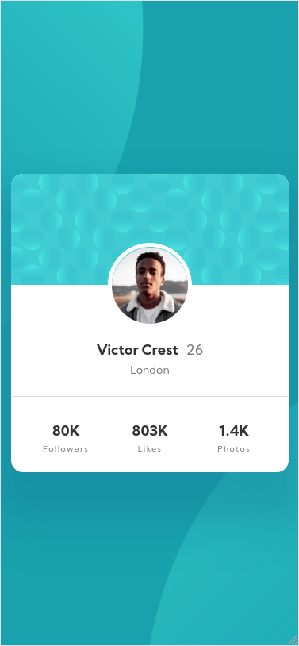

# Profile card component

This is my solution for the [Frontend Mentor challenge](https://www.frontendmentor.io/challenges/profile-card-component-cfArpWshJ) built in svelte.
You can find the demo here and two screenshots down below (desktop and mobile):

